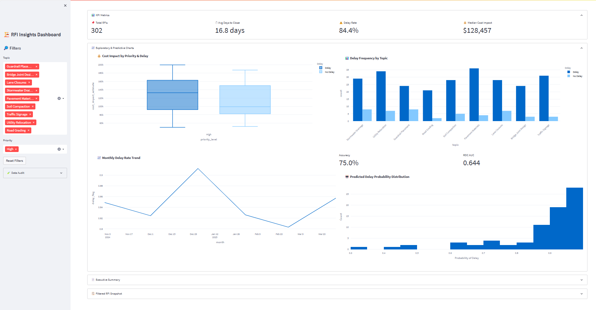

# 🏗️ Roadside RFI Risk Modeling & Synthetic Data Generation

This project simulates and predicts delays in construction workflows by modeling RFIs (Requests for Information) — a common communication bottleneck on infrastructure projects. Using synthetic data, machine learning, and an interactive dashboard, it surfaces operational risks and cost implications in real time.

https://rfi-delay.streamlit.app/

---

## 📂 Project Structure

- `RFI_Dataset_Generator.ipynb`  
  Generates a synthetic dataset of 1,500 RFIs using the `Faker` library, simulating real-world characteristics like project phase, cost impact, priority, and delay probability.

- `rfi_insights_delay_risk_modeling.ipynb`  
  Loads the generated dataset, runs exploratory analysis, builds ML classifiers (Random Forest & Logistic Regression), evaluates model performance, and generates an executive-level summary.

- `rfi_insights_dashboard.py`
  Interactive Streamlit dashboard that visualizes trends, evaluates model predictions, and produces executive summaries.

- `roadside_rfi.csv`
  Synthetic dataset used by notebooks and dashboard (generated locally).

---

## 🎯 Key Objectives

- Simulate realistic construction RFI data with explainable delay patterns
- Predict whether an RFI will cause a delay using machine learning models
- Visualize trends across cost, priority, project phase, and resolution speed
- Provide executive summaries and KPIs suitable for decision-makers

---

### 🧩 What This Demonstrates

- End-to-end ML development: data creation → modeling → deployment  
- Dashboard design for non-technical users  
- Handling imbalanced classification problems in real-world pipelines  
- Communication of insights through narrative reporting and visualization  

---

## 🧠 Features

### ✅ Synthetic Dataset Generator
- Creates 1,500+ records across diverse topics, priority levels, project phases, and cost brackets
- Introduces intelligent delay modeling based on:
  - Priority: High-priority RFIs are more likely to be delayed
  - Cost: Higher cost correlates with complexity and longer resolution times
  - Project Phase: Early or late phases exhibit different delay patterns

### ✅ Delay Prediction Models

This project uses supervised machine learning to classify whether an RFI will result in a delay. The modeling process is structured into the following steps:

#### 🔍 Exploration
- Visualize target distribution (imbalanced ~50% delayed)
- Assess feature relevance (cost, priority, phase) using grouped delay rates

#### ⚙️ Data Preparation
- **Categorical encoding**: One-hot encoding for fields like topic, status, phase
- **Scaling**: Standardization of numerical inputs (e.g., cost, days to close)
- **Class balancing**: SMOTE used to synthesize new delayed examples to balance training set

#### 🤖 Model Training
- **Logistic Regression**: Simple, interpretable baseline using `scikit-learn`
  - Pros: Fast, explainable via coefficients, well-calibrated output
- **Random Forest**: Non-linear model with built-in feature importance
  - Hyperparameter tuning via `GridSearchCV`
  - Handles interactions and non-monotonic relationships well

#### 🧪 Evaluation
- Train/test split with fixed `random_state` for reproducibility
- Metrics:  
  - **Accuracy**: Overall classification correctness  
  - **ROC AUC**: Measures rank-order discrimination (ideal for risk scoring)  
  - **Confusion matrix**, **probability distribution plots** (via histogram)

#### 📊 Interpretability & Insights
- Logistic regression coefficients reviewed for signal direction and scale  
- Random Forest feature importance highlights dominant risk indicators  
- Model used in dashboard to estimate real-time probability of delay for any given filter slice

### ✅ Exploratory Visualizations
- 📦 Cost breakdown by priority and delay outcome (Boxplot)
- 📈 Monthly delay rate trends (Line)
- 📊 Delay frequency by RFI topic (Bar)
- 🤖 Delay probability distributions from ML model (Histogram)

### Interactive Streamlit Dashboard
- Live filter controls (Choose topics and priority levels)
- Data quality audit ( Highlights missing flags or corrupted values)
- KPI Metrics: Total RFIs, Avg. Days to Close, Median Cost, Delay Rate
- Charts:
  - 📦 Cost vs Priority & Delay (Boxplot) 
  - 📈 Monthly Delay Rate Trend (Line)
  - 📊 Delay Frequency by Topic (Bar) 
  - 🤖 Delay Probability Distribution (Histogram)
- Model Performance Metrics: Accuracy and ROC AUC from live Logistic Regression
- Auto-generated Executive Summary:
  - Summarizes top delayed topics/phases
  - Includes cost insights by priority
  - Outputs summary in downloadable Markdown

### ✅ Executive Report Generator
Outputs a Markdown-formatted summary including:
- Avg. days to close
- Delay rate
- Delay likelihood by priority and project phase
- Cost impact distribution

---

## 🛠️ Technologies Used

- **Python 3.8+**  
- **Streamlit** – Interactive data app framework
- **Pandas, NumPy** – Data manipulation  
- **Faker** – Synthetic data generation  
- **Matplotlib, Seaborn, Plotly** – Data Visualization  
- **scikit-learn** – ML models and preprocessing  
- **imblearn (SMOTE)** – Class imbalance handling  

---

## 📈 Sample Output

## 📈 Key Results

- **Logistic Regression Accuracy**: ~67%  
- **Random Forest Accuracy**: ~64%  
- **ROC AUC**: ~0.73 (Good classification separation)  
- **Delay Rate**: 48.9% of RFIs flagged as delayed  
- **Delay Risk Insight**: High-priority RFIs are **3.3×** more likely to be delayed than low-priority  
- **Top Delayed Phases**: Construction → Final Design  
- **Median Cost Impact**: $8,647  
- **Synthetic Dataset**: 1,500+ RFIs with intelligent delay modeling based on cost, phase, and priority  
- **Interactive Dashboard**: Real-time risk scoring with live filtering and executive summary export  

> ✅ ML models effectively surface delay risk drivers and support informed decision-making.

---

## 🚀 Getting Started

1. Clone this repo  
2. Generate synthetic data
    - Open and run `RFI_Dataset_Generator.ipynb` to generate `roadside_rfi.csv`  
   
3. Run ML notebook
    - Open and run `rfi_insights_delay_risk_modeling.ipynb` for analysis, modeling, and summary generation.
    
---

## 🙋‍♀️ Author

Developed by Richie Garafola 
A demonstration of how synthetic data, machine learning, and interactive dashboards can drive decision-making in construction project analytics.
